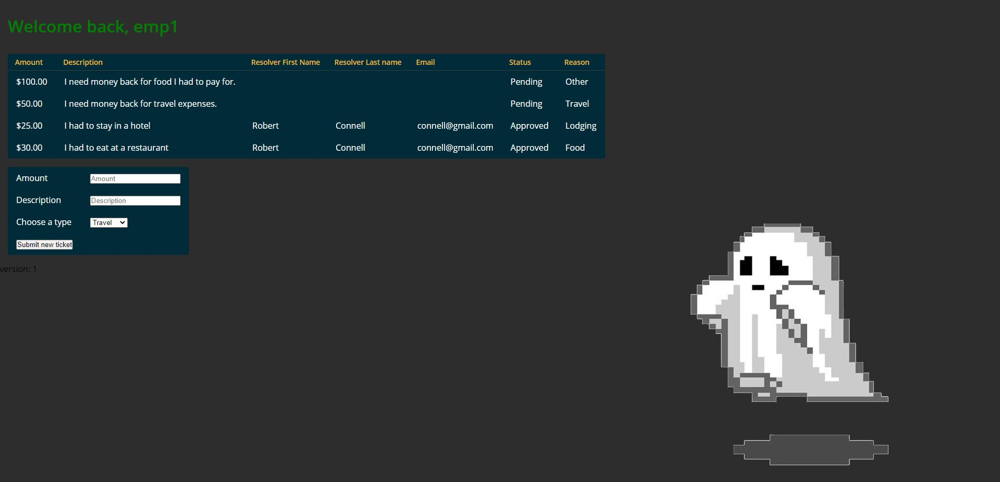
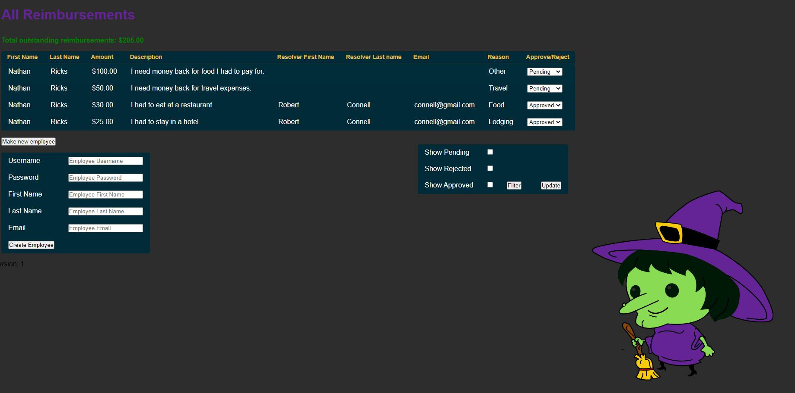

# Expense Reimbursement System

# Project Description
The Expense Reimbursement System (ERS) will manage the process of reimbursing employees for expenses incurred while on company time. All employees in the company can login and submit requests for reimbursement and view their past tickets and pending requests. Finance managers can log in and view all reimbursement requests and past history for all employees in the company. Finance managers are authorized to approve and deny requests for expense reimbursement.

# Technologies Used
<li>JavaScript</li>      
<li>HTML</li>             
<li>CSS</li>              
<li>AJAX</li>             
<li>PostgreSQL</li>
<li>Java</li>
<li>Servlets</li>
<li>JDBC</li>
<li>Agile-Scrum</li>

# Features
<li>Submit reimbursement requests</li>
<li>Have reimbursement requests approved</li>
<li>Remove users from the system</li>
<li>Display all or only relevant reimbursements</li>

# Getting Started
<li>Step 1:  git clone https://github.com/ricksnp/Reimbursement.git onto your machine </li>
<li>Step 2:  Open the project in an environment in which you have a Tomcat Server Runtime Environment </li>
<li>Step 3:  Once inside an appropriate environment, start the Tomcat server runtime </li>
<li>Step 4:  View http://localhost:8080/Reimbursement/ in the browser of your choice </li>

# Display

